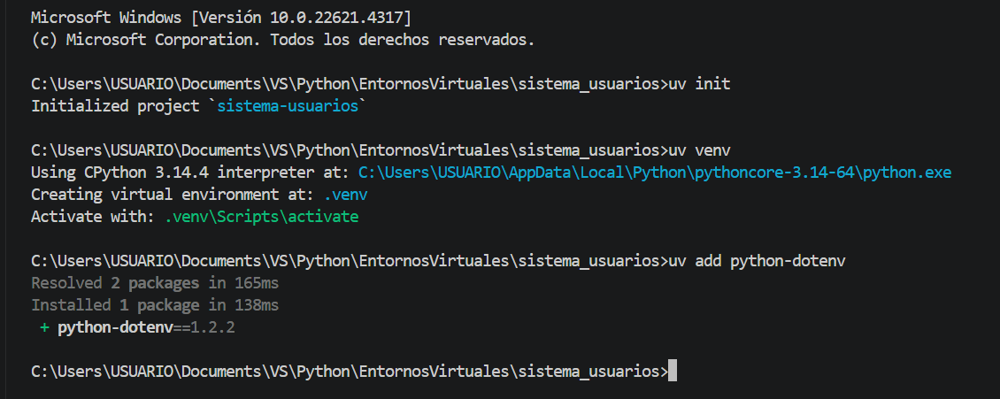
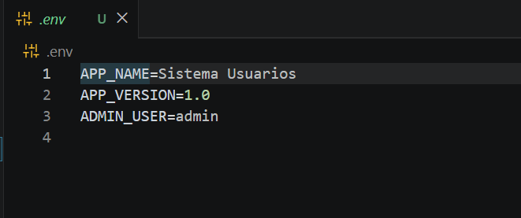
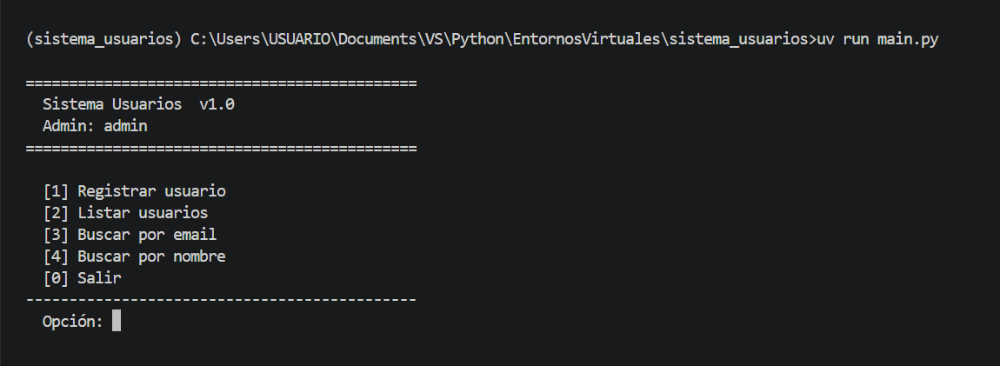
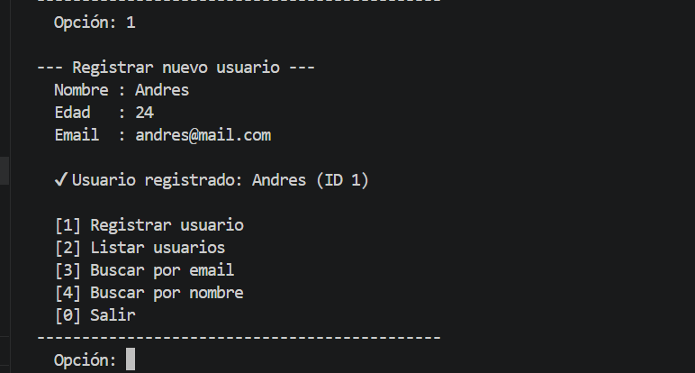
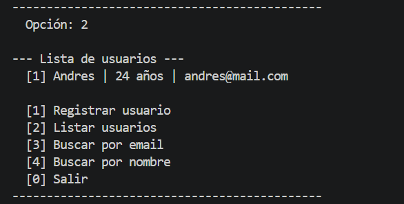
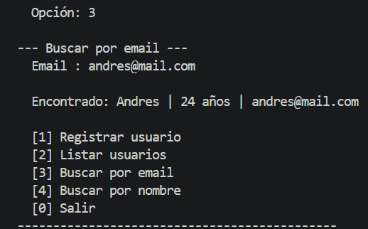
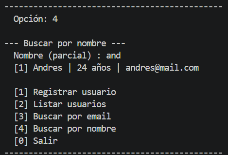

# Sistema de Gestión de Usuarios

Proyecto integrador.
Santiago Pinzon Gallego
Ficha 3114227

Aplicación de consola en Python que permite registrar, listar y buscar usuarios, construida con entornos virtuales, variables de entorno y estructura modular.

Adjunto el enlace del video https://youtu.be/IGndVi1Mk08

---

## Estructura del proyecto

```
sistema_usuarios/
├── app/
│   ├── __init__.py
│   ├── config/
│   │   ├── __init__.py
│   │   └── settings.py
│   └── usuarios/
│       ├── __init__.py
│       ├── gestor.py
│       └── validaciones.py
├── docs/
│   └── img/
├── .env
├── .env.example
├── main.py
├── pyproject.toml
└── README.md
```

---

## Módulos y responsabilidades

| Archivo | Qué hace |
|---|---|
| `main.py` | Punto de entrada. Muestra el menú y conecta todo. |
| `app/config/settings.py` | Lee las variables del archivo `.env` y las expone al resto de la app. |
| `app/usuarios/gestor.py` | Registra, lista y busca usuarios. |
| `app/usuarios/validaciones.py` | Verifica que los datos ingresados sean correctos antes de guardarlos. |

---

## Requisitos previos

- Python 3.11 o superior
- [uv](https://docs.astral.sh/uv/) instalado

```bash
pip install uv
```

---

## Instalación y configuración

**1. Clonar el repositorio**

```bash
git clone <https://github.com/krlcfr/sistema_usuarios.git>
cd sistema_usuarios
```

**2. Crear el entorno virtual**

```bash
uv venv
```

Esto genera la carpeta `.venv` con Python aislado solo para este proyecto.



**3. Instalar dependencias**

```bash
uv add python-dotenv
```

`uv` descarga la librería y actualiza el `pyproject.toml` automáticamente.

**4. Configurar las variables de entorno**

Copia el archivo de ejemplo y edítalo con tus valores:

```bash
cp .env.example .env
```

Contenido del `.env`:

```
APP_NAME=Sistema Usuarios
APP_VERSION=1.0
ADMIN_USER=admin
```

> El archivo `.env` nunca se sube a GitHub. El `.env.example` sirve como plantilla pública.



---

## Cómo ejecutar el proyecto

```bash
uv run main.py
```

> `uv run` activa el entorno virtual automáticamente antes de correr el archivo.



---

## Uso del sistema

Al ejecutar el programa aparece un menú con cuatro opciones:

```
=============================================
  Sistema Usuarios  v1.0
  Admin: admin
=============================================

  [1] Registrar usuario
  [2] Listar usuarios
  [3] Buscar por email
  [4] Buscar por nombre
---------------------------------------------
```









---

## Variables de entorno

Las variables se leen desde el archivo `.env` usando la librería `python-dotenv`.  
El módulo `app/config/settings.py` se encarga de cargarlas al iniciar la app.

| Variable | Valor por defecto | Descripción |
|---|---|---|
| `APP_NAME` | Sistema Usuarios | Nombre de la aplicación |
| `APP_VERSION` | 1.0 | Versión actual |
| `ADMIN_USER` | admin | Usuario administrador |

---

## Dependencias

Gestionadas con `uv`. Definidas en `pyproject.toml`.

| Paquete | Versión | Para qué se usa |
|---|---|---|
| `python-dotenv` | 1.2.2 | Leer el archivo `.env` desde Python |
